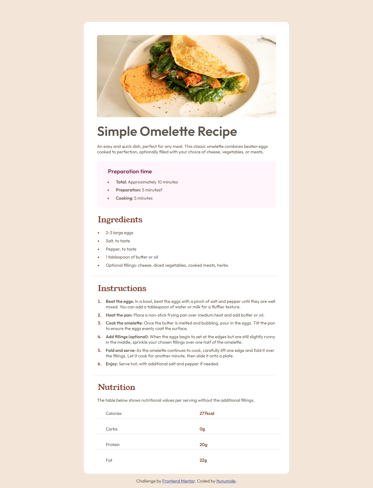

# Frontend Mentor - Recipe page solution

This is a solution to the [Recipe page challenge on Frontend Mentor](https://www.frontendmentor.io/challenges/recipe-page-KiTsR8QQKm). Frontend Mentor challenges help you improve your coding skills by building realistic projects.

## Overview

### Screenshot

### Links

- Solution URL: [Add solution URL here](https://github.com/itunumide/recipe-page)
- Live Site URL: [Add live site URL here](https://recipe-page-raji-itunu-idowus-projects.vercel.app/)

## My process

### Built with

  - Semantic HTML5
  - CSS3 custom properties
  - Flexbox for layout
  - Media queries for responsive design
  - Google Fonts – Outfit and Young Serif
  - Desktop-first workflow

### What I learned

- How to use semantic HTML for better structure and accessibility.
  - How to structure a responsive layout with flex-direction: column.
  - How to use calc() in CSS:
    - width: calc(100% + 4rem);
    - This helped me create edge-to-edge images on mobile screens.
  - Applying box-sizing: border-box to simplify spacing and layout sizing.
  - Custom list styles with ::marker for better control over bullet aesthetics.
  - Maintaining consistent spacing and layout with utility classes (e.g. .spaced-list).

### Continued development

In the future, I plan to:
  - Add accessibility improvements like better focus states and ARIA labels.
  - Use CSS Grid for more complex layouts.
  - Explore using clamp() and other modern CSS functions for fluid typography and spacing.
  - Convert this static page to a React component using a framework like Next.js.
  - Improve image optimization and lazy loading. 

### Useful resources

 - MDN Web Docs – for checking calc(), media queries, and list styling.
  - CSS Tricks - Box Sizing – helpful for understanding layout behavior.

## Author

- Website - [Add your name here](https://itunu-i-raji.vercel.app)
- Frontend Mentor - [@yourusername](https://www.frontendmentor.io/profile/ITUNUMIDE)
- Twitter - [@yourusername](https://www.twitter.com/ITUNUMIDE3)

## Acknowledgments

- Thanks to the Frontend Mentor community for the encouragement and inspiration. Also a shoutout to anyone who shares thoughtful feedback on submissions — it's a great way to learn and grow!

